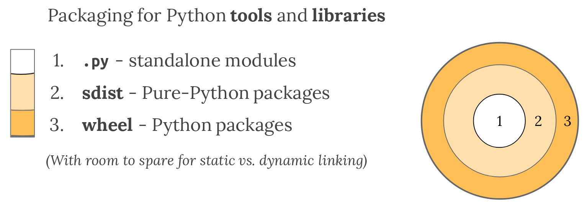

## Python Language

* [**Comprehensive Python Cheatsheet**](https://gto76.github.io/python-cheatsheet/)
* [match Statement](https://docs.python.org/3/tutorial/controlflow.html#match-statements)
* [More on Defining Functions](https://docs.python.org/3/tutorial/controlflow.html#more-on-defining-functions)
* [Comparing Sequences and Other Types](https://docs.python.org/3/tutorial/datastructures.html#comparing-sequences-and-other-types)
* [Formatted String Literals (f-string)](https://docs.python.org/3/tutorial/inputoutput.html#formatted-string-literals)
* [Special method names (dunder method)](https://docs.python.org/3/reference/datamodel.html#special-method-names), details in [Python Data Model](https://docs.python.org/3/reference/datamodel.html)
* [variable annotation](https://docs.python.org/3/glossary.html#term-variable-annotation)
* [free threading](https://docs.python.org/3/glossary.html#term-free-threading)
* [sequence unpacking](https://docs.python.org/3/tutorial/datastructures.html#tuples-and-sequences)


## [Coding Style](https://docs.python.org/3/tutorial/controlflow.html#intermezzo-coding-style)


## [Python Packaging](https://packaging.python.org/en/latest/)

### [Packaging Python libraries and tools](https://packaging.python.org/en/latest/overview/#packaging-python-libraries-and-tools)

Three approaches:

- **Python modules**: a single Python file

- **Python source distributions**:  So long as your code contains nothing but pure Python code, and you know your deployment environment supports your version of Python, then you can use Python’s native packaging tools to create a *source* [Distribution Package](https://packaging.python.org/en/latest/glossary/#term-Distribution-Package), or *sdist* for short.

  Python’s *sdists* are compressed archives (`.tar.gz` files) containing one or more packages or modules. If your code is pure-Python, and you only depend on oth

- **Python binary distributions**: the [Wheel](https://packaging.python.org/en/latest/glossary/#term-Wheel), a package format designed to ship libraries with compiled artifacts. In fact, Python’s package installer, `pip`, always prefers wheels because installation is always faster, so even pure-Python packages work better with wheels.



### [Packaging Python applications](https://packaging.python.org/en/latest/overview/#packaging-python-applications)

(not interesting for programmers)

### [The Packaging Flow](https://packaging.python.org/en/latest/flow/#the-packaging-flow)

1. Have a source tree containing the package
2. Prepare a configuration file `pyproject.toml`
3. Build [source distribution (“sdist”)](https://packaging.python.org/en/latest/glossary/#term-Source-Distribution-or-sdist) and one or more [built distributions (“wheels”)](https://packaging.python.org/en/latest/glossary/#term-Built-Distribution)
4. Upload the build artifacts to the package distribution service (PyPI)
5. (using pip) Download one of the package’s build artifacts from the package distribution service.
6. (using pip) Install it in their Python environment, usually in its `site-packages` directory. This step may involve a build/compile step which, if needed, must be described by the package metadata.

### [Packaging Python Projects](https://packaging.python.org/en/latest/tutorials/packaging-projects/#packaging-python-projects)

packaging_tutorial/
├── LICENSE
├── [pyproject.toml](https://packaging.python.org/en/latest/specifications/pyproject-toml/)
├── README.md
├── src/
│   └── example_package_YOUR_USERNAME_HERE/
│       ├── __init__.py
│       └── example.py
└── tests/

### [Is `setup.py` deprecated?](https://packaging.python.org/en/latest/discussions/setup-py-deprecated/#setup-py-deprecated)

No, [setup.py](https://packaging.python.org/en/latest/glossary/#term-setup.py) and [Setuptools](https://packaging.python.org/en/latest/key_projects/#setuptools) are not deprecated.

Setuptools is perfectly usable as a [build backend](https://packaging.python.org/en/latest/glossary/#term-Build-Backend) for packaging Python projects. And `setup.py` is a valid configuration file for [Setuptools](https://packaging.python.org/en/latest/key_projects/#setuptools) that happens to be written in Python, instead of in *TOML* for example (a similar practice is used by other tools like *nox* and its `noxfile.py` configuration file, or *pytest* and `conftest.py`).

However, `python setup.py` and the use of `setup.py` as a command line tool are deprecated.

This means that commands such as the following **MUST NOT** be run anymore:

- `python setup.py install`
- `python setup.py develop`
- `python setup.py sdist`
- `python setup.py bdist_wheel`

### [Installing Packages](https://packaging.python.org/en/latest/tutorials/installing-packages/#installing-packages)

According to the spirit of  PEP 668, always use virtual environment. Don't use "--user" because it's still using the system Python executable.

#### [pip](https://pip.pypa.io/en/stable/)

https://pip.pypa.io/en/latest/user_guide/#requirements-files

## FFI

### [ctypes](https://docs.python.org/3/library/ctypes.html)

Using `ctypes` is like building a bridge between the high-level world of Python and the low-level performance of C. On Linux, this usually involves loading a shared object file (`.so`).

Here is a straightforward example to get you started.

------

##### 1. Create the C Code

First, let's write a simple function in a file named `example.c`. This function will add two integers and return the result.

C

```
// example.c
int add_integers(int a, int b) {
    return a + b;
}
```

##### 2. Compile to a Shared Library

You need to compile this into a shared object file so Python can "see" it. Run this command in your terminal:

Bash

```
gcc -fPIC -shared -o libexample.so example.c
```

- `-fPIC`: Generates position-independent code (required for shared libraries).
- `-shared`: Tells the compiler to create a shared library instead of an executable.

##### 3. Call it from Python

Now, use `ctypes` to load the library and call the function.

Python

```
import ctypes
import os

# 1. Load the shared library
# We use os.getcwd() to ensure we find the file in the current folder
lib_path = os.path.join(os.getcwd(), "libexample.so")
lib = ctypes.CDLL(lib_path)

# 2. Define the argument and return types (Best Practice)
# This prevents Python from passing the wrong data types to C
lib.add_integers.argtypes = (ctypes.c_int, ctypes.c_int)
lib.add_integers.restype = ctypes.c_int

# 3. Call the function
result = lib.add_integers(15, 27)

print(f"The result from C is: {result}")
```

------

### Key Takeaways

- **`CDLL`**: This is used for libraries that use the standard C calling convention (`cdecl`).
- **`.argtypes`**: Always define these! Without them, `ctypes` doesn't know if you're passing an integer, a float, or a pointer, which can lead to nasty crashes (Segmentation Faults).
- **`.restype`**: By default, `ctypes` assumes the return type is a C `int`. If your function returns something else (like a `double` or a `char*`), you must specify it.

Would you like me to show you how to pass more complex data, like a **string** or a **struct**, between Python and C?

### [Extension](https://docs.python.org/3/extending/index.html)


## OS-specific configurations

[Homebrew](https://docs.brew.sh/Homebrew-and-Python)
[Ubuntu](https://documentation.ubuntu.com/ubuntu-for-developers/howto/python-setup/#install-python)

## venv or apt-get to install Python packages
For python packages that user want to use globally, use system package manager to install it (like apt-get on Ubuntu)
For python packates that are specific to a project, use venv to install it

## [decorator](https://docs.python.org/3/glossary.html#term-decorator)

```python
def f(arg):
    ...
f = staticmethod(f)

@staticmethod
def f(arg):
    ...
```


## [pytest](https://docs.pytest.org/en/stable/getting-started.html)

### Create your first test
Create a new file called test_sample.py, containing a function, and a test:
```python
# content of test_sample.py
def func(x):
    return x + 1


def test_answer():
    assert func(3) == 5
```

The test
```bash
$ pytest
=========================== test session starts ============================
platform linux -- Python 3.x.y, pytest-9.x.y, pluggy-1.x.y
rootdir: /home/sweet/project
collected 1 item

test_sample.py F                                                     [100%]

================================= FAILURES =================================
_______________________________ test_answer ________________________________

    def test_answer():
>       assert func(3) == 5
E       assert 4 == 5
E        +  where 4 = func(3)

test_sample.py:6: AssertionError
========================= short test summary info ==========================
FAILED test_sample.py::test_answer - assert 4 == 5
============================ 1 failed in 0.12s =============================
```

pytest will run all files of the form test_*.py or *_test.py in the current directory and its subdirectories. More generally, it follows standard test discovery rules.

The [100%] refers to the overall progress of running all test cases. After it finishes, pytest then shows a failure report because func(3) does not return 5.

