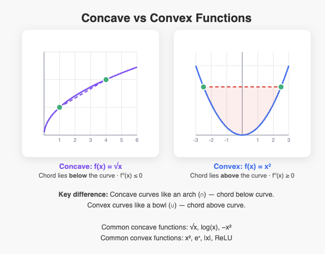

## Convex Function

A **convex function** is one where the line segment connecting any two points on the graph lies **above or on** the graph itself. Formally:

f(λx₁ + (1−λ)x₂) ≤ λf(x₁) + (1−λ)f(x₂) for all x₁, x₂ and λ ∈ [0,1]

Intuitively: the function "curves upward" — like a bowl. If you pick any two points on the curve and draw a straight line between them, that line stays above the curve.The graph shows f(x) = x² as a classic example of a convex function. Key things to notice:

- **The red dashed chord** connecting two points on the curve always lies *above* the curve — this is the geometric definition of convexity.
- **The shaded region** highlights the gap between the chord and the curve.
- A convex function "bowls upward" — its second derivative f''(x) ≥ 0 everywhere (for x², f''(x) = 2 > 0).

Common examples of convex functions: x², eˣ, |x|, and ReLU. A **concave** function is the opposite (bowls downward), like log(x) or √x.

## Concave Function

A **concave function** is the opposite of a convex function. The line segment connecting any two points on the graph lies **below or on** the curve:

f(λx₁ + (1−λ)x₂) ≥ λf(x₁) + (1−λ)f(x₂) for all x₁, x₂ and λ ∈ [0,1]

Intuitively: the function "curves downward" — like an upside-down bowl. For twice-differentiable functions, f''(x) ≤ 0 everywhere.The graph shows both side by side so you can see the contrast clearly. Here's a quick summary:

|                | Concave             | Convex              |
| -------------- | ------------------- | ------------------- |
| Shape          | ∩ (arch)            | ∪ (bowl)            |
| Chord position | **below** the curve | **above** the curve |
| 2nd derivative | f''(x) ≤ 0          | f''(x) ≥ 0          |
| Examples       | √x, log(x), −x²     | x², eˣ, ReLU        |

A simple memory trick: **con-CAVE** — the function caves *inward* at the top, like a cave ceiling.

## IEEE-754

The thing is: Floating-point numbers are approximations. You want to use a wide range of exponents and a limited number of digits and get results which are not completely wrong. :)

The idea behind IEEE-754 is that every operation could trigger "traps" which indicate possible problems. They are

- Illegal (senseless operation like sqrt of negative number)
- Overflow (too big)
- Underflow (too small)
- Division by zero (The thing you do not like)
- Inexact (This operation may give you wrong results because you are losing precision)

Now many people like scientists and engineers do not want to be bothered with writing trap routines. So Kahan, the inventor of IEEE-754, decided that every operation should also return a sensible default value if no trap routines exist.

They are

- NaN for illegal values
- signed infinities for Overflow
- signed zeroes for Underflow
- NaN for indeterminate results (0/0) and infinities for (x/0 x != 0)
- normal operation result for Inexact

The thing is that in 99% of all cases zeroes are caused by underflow and therefore in 99% of all times Infinity is "correct" even if wrong from a mathematical perspective.

## eigenvector

- **Definition:** An eigenvector of a square matrix (or linear operator) $A$ is a nonzero vector $\mathbf{v}$ that is only scaled (not rotated) by $A$: $A\mathbf{v}=\lambda\mathbf{v}$, where $\lambda$ is the corresponding eigenvalue.

- **How to find them:** Solve $(A-\lambda I)\mathbf{v}=0$ for nontrivial $\mathbf{v}$; nonzero solutions exist when $\det(A-\lambda I)=0$ (the characteristic equation) — solve that for $\lambda$, then find each $\mathbf{v}$.

- **Geometric meaning:** Eigenvectors point along directions that $A$ stretches/compresses by factor $\lambda$ (including sign/rotation by negative $\lambda$), so they reveal the principal directions of the linear map.

- **Why they matter:** diagonalization, matrix powers, solving linear dynamical systems, stability analysis, PCA (data dimensionality reduction), modal analysis, and many algorithms in ML and physics.

- **Simple example:** For $A=\begin{pmatrix}2&0\\0&3\end{pmatrix}$, eigenvectors are $(1,0)^T$ with eigenvalue $2$, and $(0,1)^T$ with eigenvalue $3$.

